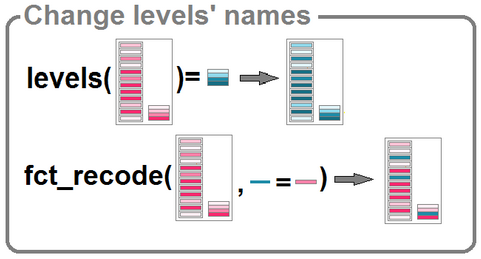
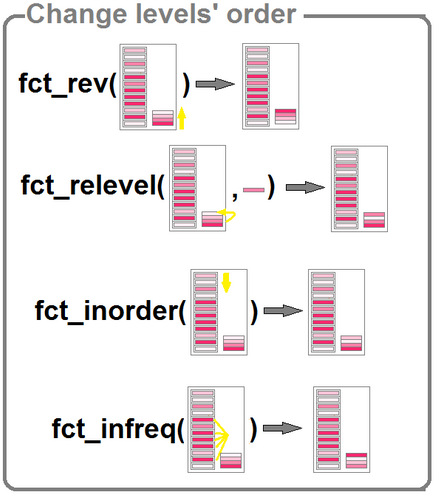

# Quelques préliminaires

## Vocabulaire

- Statistique : un *résumé* de l'information contenue dans l'ensemble des observation. Par exemple : la somme, la moyenne, l'écart-type, les quantiles...

- Description des données : un tableau peut être regardé comme un ensemble de lignes (des individus statistiques) ou comme un ensemble de colonnes (des variables).

<center>

</center>

$\rightarrow$ structure du tableau (`dataframe`) à modifier ? Voir [le module 2 sur la préparation des données](https://rawgit.com/MTES-MCT/parcours-r/master/Supports_formations/m2_preparer_ses_donnees_avec_R_et_le_tidyverse/_book/index.html).


## Données utilisées pour la formation

Nous utiliserons la base Insee de comparaison des territoires. Pour chaque commune, nous disposons d'un certain nombre d'informations, contenues dans les différentes variables (population, naissance, décès, nombre de logements, etc...).

```{r}
str (dat)  # premier aperçu de la base
```

Liste des variables : 

- *CODGEO* : Code du département suivi du numéro de commune ou du numéro d'arrondissement municipal

- *LIBGEO* : Libellé de la commune ou de l'arrondissement municipal pour Paris, Lyon et Marseille

- *REG* : Région

- *DEP* : Département

- *ZAU* : Classe du zonage en aires urbaines

- *ZE* : Zone d'emploi

- *P14_POP* : Population en 2014

- *P09_POP* : Population en 2009

- *SUPERF* : Superficie (en $km^2$)

- *NAIS0914* : Nombre de naissances entre le 01/01/2009 et le 01/01/2014

- *DECE0914* : Nombre de décès entre le 01/01/2009 et le 01/01/2014

- *P14_MEN* : Nombre de ménages en 2014

- *NAISD15* : Nombre de naissances domiciliées en 2015

- *DECESD15* : Nombre de décès domiciliés en 2015

- *P14_LOG* : Nombre de logements en 2014

- *P14_RP* : Nombre de résidences principales en 2014

- *P14_RSECOCC* : Nombre de résidences secondaires et logements occasionnels en 2014

- *P14_LOGVAC* : Nombre de logements vacants en 2014

- *P14_RP_PROP* : Nombre de résidences principales occupées par propriétaires en 2014

- *NBMENFISC14* : Nombre de ménages fiscaux en 2014

- *PIMP14* : Part des ménages fiscaux imposés en 2014

- *MED14* : Médiane du niveau de vie en 2014

- *TP6014* : Taux de pauvreté en 2014

- *P14_EMPLT* : Nombre d'emplois au lieu de travail en 2014

- *P15_EMPLT_SAL* : Nombre d'emplois salariés au lieu de travail en 2015

- *P09_EMPLT* : Nombre d'emplois au lieu de travail en 2009

- *P15_POP1564* : Nombre de personnes de 15 à 64 ans en 2015

- *P15_CHOM1564* : Nombre de chômeurs de 15 à 64 ans en 2015

- *P15_ACT1564* : Nombre de personnes actives de 15 à 64 ans en 2015


## Variables quantitatives

Une variable **quantitative** permet de mesurer une grandeur (quantité). Elle peut être :

- **discrète** (un nombre fini de valeurs possibles). *Exemple : un nombre de logements*

- **continue** (*a priori*, toutes les valeurs possibles). *Exemple : une taille, une surface, un revenu*


On peut calculer des statistiques (somme, moyenne, ...) sur les variables quantitatives.

Dans R, il s'agit des variables de type `numeric`. Par exemple : 

```{r}
v <- c (12.5, 25.38, 14.9)
class (v)
```


## Variables qualitatives
### Définition

Une variable **qualitative** indique des caractéristiques qui ne sont pas des quantités. Les différentes valeurs que peut prendre cette variable sont appelées les catégories ou modalités (`levels` dans R). Elle peut être :

- **ordonnée** (exprimer un ordre). *Exemple : "petit - moyen - grand "*

- **non ordonnée**. *Exemple : une couleur, un groupe sanguin...*


Une variable qualitative ne permet pas de faire des calculs (la moyenne d'un groupe sanguin n'a aucun sens).

Dans R, il s'agit des variables `factor`. Elles peuvent être générée par la fonction `factor()`. Par exemple : 

```{r factor1}
v <- factor (x = c ("un peu", "beaucoup", "passionnément", "beaucoup",
                    "un peu", "un peu", "un peu"))
class (v)
```

Les modalités de la variable peuvent être obtenues grâce à la fonction `levels()`.

```{r}
levels (v)
v %>% table ()
```

NB : Ce sont des étiquettes mais la variable est stockée sous forme d'entiers.

```{r}
as.integer (v) %>% table ()
```


### Manipulation des `factor`


La manipulation des `factor` fait intervenir le package [`forcats`](https://cran.r-project.org/web/packages/forcats/forcats.pdf), du "méta-package" [`tidyverse`](https://www.tidyverse.org/), qui propose de nombreuses fonctions.


Les fonctions de ce package sont reconnaissables à leur préfixe `fct_`.

On peut trouver des exemples d'utilisation (en français) [sur ce blog](http://perso.ens-lyon.fr/lise.vaudor/manipulation-de-facteurs-avec-forcats/).

- Dans un dataframe contenant une variable de type `factor`, on filtre comme sur une chaîne de caractère :
```{r, warning = FALSE}
d <- filter (dat, str_sub (string = ZAU, start = 1, end = 3) != "120")
# ou bien :
d <- filter (dat, ZAU != "111 - Grand pôle (plus de 10 000 emplois)")
```

- A la suite d'une opération de sélection des parmi les lignes, certains `levels` peuvent disparaître. Ils seront toutefois toujours présents dans la liste des modalités de la variables. La fonction `fct_drop()`, appliquée sur un vecteur, permet de se débarasser des modalités désormais inutilisées.

```{r}
d %>% pull (ZAU) %>% levels ()
d %>% pull (ZAU) %>% fct_drop () %>% levels ()
```

La modalité "`r levels (dat$ZAU)[1]`" a bien été supprimée.

Pour effectuer l'opération sur l'ensemble des variables `factor` d'un `dataframe`, il faut utiliser la fonction `droplevels()` du package `base`. 


- Les fonctions `levels()` et `fct_recode()` permettent de modifier les `levels`. La fonction `levels()` renomme toutes les modalités et s'applique sur un vecteur de type `factor`. `fct_recode()` permet de renommer seulement les `levels` voulus et peut être imbriqué dans un `mutate()`.


```{r}

vec_ZAU <- pull (dat, ZAU)
levels(vec_ZAU) <- c("111 - Grand pôle",
                     "112 - Couronne GP",
                     "120 - Multipol grandes AU",
                     "211 - Moyen pôle",
                     "212 - Couronne MP" ,
                     "221 - Petit pôle",
                     "222 - Couronne PP",
                     "300 - Autre multipol.",
                     "400 - Commune isolée")
levels (vec_ZAU)
dat$ZAU2 <- vec_ZAU # création de la variable ZAU2 dans le data frame dat


dat <- dat %>%
  mutate (DEP2 = fct_recode (DEP, "Ain" = "01", "Aisne" = "02"))

```

- Pour agréger des facteurs et compter le nombre de modalités, on peut se servir de `fct_count()` :

```{r}
pull (dat, ZAU2) %>%
  fct_recode (urbain = "111 - Grand pôle", urbain = "211 - Moyen pôle", 
              urbain = "221 - Petit pôle", 
              periurbain = "112 - Couronne GP", periurbain = "212 - Couronne MP", 
              periurbain = "120 - Multipol grandes AU", periurbain = "300 - Autre multipol.", 
              periurbain = "222 - Couronne PP",
              rural = "400 - Commune isolée") %>%
  fct_count ()
```


- Pour modifier l'ordre des facteurs (cela peut être utile en particulier pour les représentations graphiques), il existe plusieurs fonctions : 



```{r changeFactors}

# renverser l'ordre
dat <- dat %>%
  mutate (ZAU3 = fct_rev (ZAU2))

# ordonner "à la main"
dat <- dat %>%
  mutate (ZAU3 = fct_relevel (ZAU2, "221 - Petit pôle", "111 - Grand pôle"))

# ordonner selon ordre d'apparition
dat <- dat %>%
  mutate (ZAU3 = fct_inorder (ZAU2))

# ordonner selon la fréquence
dat <- dat %>%
  mutate (ZAU3 = fct_infreq (ZAU2))

```