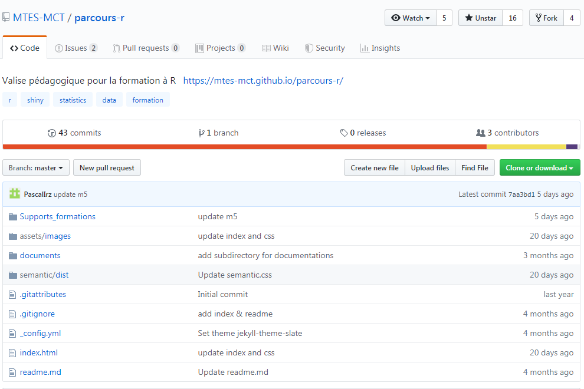
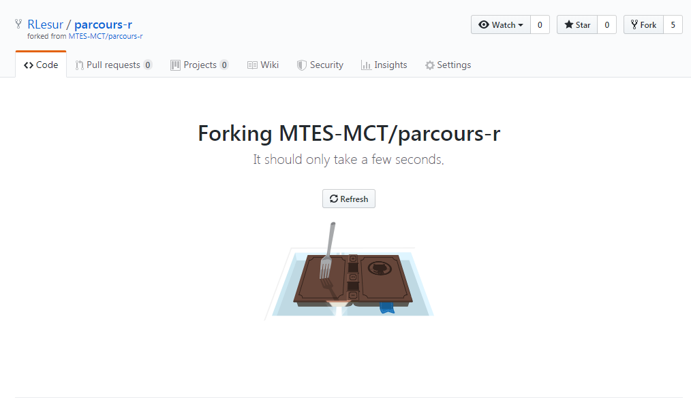

# Contribuer au parcours de formation R

Nous allons étudier le cas le plus complexe, à savoir la contribution à un dépôt qui n'est pas un projet RStudio. Pour cela, nous allons devoir utiliser git dans le terminal.

Nous allons voir cela au travers d'un exemple : nous allons créer une contribution au parcours de formation R dont les fichiers source sont hébergés sur le dépôt <https://github.com/MTES-MCT/parcours-r>.

## Comment sait-on que ce dépôt n'est pas un projet RStudio ?

Pour cela, il faut acquérir un premier réflexe : lire la liste des fichiers qui se trouvent à la racine du dépôt^[la racine d'un dépôt est le premier niveau dans les dossiers.].



On constate qu'il n'y a aucun fichier qui a pour extension `.Rproj` : ce n'est pas un projet RStudio.

## Opérations sur Github

### Avoir un compte Github

Le dépôt auquel nous voulons contribuer est hébergé sur une forge logicielle qui s'appelle Github. Pour pouvoir contribuer, il est obligatoire de disposer d'un compte sur cette forge (toutes les forges fonctionnent de la même façon : on est obligé de s'identifier pour contribuer).

_détailler comment on crée un compte sur github_

Assurez-vous que vous êtes bien identifiés sur Github avant de continuer.

### Créer une copie de travail sur Github

Nous sommes dans un cas de figure très courant : nous voulons contribuer à un dépôt pour lequel nous n'avons pas les droits en écriture. Cependant, nous allons voir que nous pouvons proposer des modifications aux responsables du projet. 

Le seul moyen que nous avons pour travailler est de modifier une copie personnelle de travail de ce dépôt.

Pour cela, nous allons créer un "Fork", c'est-à-dire une copie personnelle de travail. 

Il n'y a qu'une chose à faire : sur la page d'accueil du dépôt, cliquez sur le bouton "Fork" qui se trouve en haut à droite de la page d'accueil du dépôt.

Ensuite, vous allez voir cet écran :



Et après quelques secondes, vous vous retrouvez sur une page qui ressemble à s'y méprendre à la page d'accueil du dépôt.


Arrêtez-vous quelques instants et :

- examinez le chemin qui se trouve dans la barre d'addresse de votre navigateur
- regardez attentivement ce qui est écrit en haut à gauche

Vous constatez en haut à gauche qu'il est écrit `RLesur/parcours-r` : ce n'est pas le dépôt original, c'est ma copie de travail. Et juste en dessous, il est écrit : _forked from MTES-MCT/parcours-r_. Cela signifie que cette copie de travail conserve un lien avec le dépôt "officiel".

## Opérations dans RStudio

### Préparation 

La première étape est de préparer son environnement de travail.  
Il n'y a qu'une chose à faire : **s'assurer que nous n'avons pas de projet RStudio d'ouvert**.  

**Comment est-ce qu'on sait si on a un projet RStudio d'ouvert ?**

Il faut regarder en haut à droite de RStudio .

Si vous voyez `Project: (None)`, cela signifie que vous n'avez aucun projet d'ouvert.

Si vous voyez autre chose, vous avez deviné, c'est que vous avez un projet d'ouvert. Et vous devez le fermer.  
Pour cela, il faut cliquer sur le nom du projet puis `Close Project` 

### Créer une copie locale de sa copie de travail Github

Maintenant que vous êtes certains d'avoir fermé votre projet RStudio, nous allons encore créer une copie de travail !

Là, vous vous dites sûrement : mais on vient de le faire sur Github ? Oui, mais on comme on veut travailler depuis notre ordinateur, on va devoir réaliser une copie locale de notre copie de travail qui se trouve sur Github. Comme ça, on est tranquille, on peut travailler depuis notre ordinateur (dans le train, par exemple) et pousser plus tard nos modifications sur notre copie de travail qui se trouve sur Github.

Pour cela, nous allons devoir utiliser le Terminal et y saisir des instructions.

::::card
<h4 class="card-title"> Ai-je vraiment le droit d'utiliser le terminal ? </h4>
:::card-body
Oui. Le terminal, c'est un peu comme la console de R : on saisit des instructions et notre machine les exécute. Mais ce ne sont pas des instructions en langage R, c'est la seule différence. Comme avec R, on peut faire des bêtises : supprimer des fichiers, par exemple. Donc, comme toujours, il faut comprendre ce que l'on fait pour éviter de faire des erreurs.
:::
::::

Pour créer une copie locale, il va nous falloir récupérer une information : l'adresse de notre copie de travail. Elle se trouve sur la page d'accueil de notre copie de travail qui est sur Github 


Une fois l'adresse en poche, nous tapons dans le Terminal de RStudio : 

```bash
cd ~

git clone <adresse-précédente>
```

Et là, vous devriez voir dans le terminal :

```
Clonage dans 'parcours-r'...
remote: Enumerating objects: 848, done.
remote: Counting objects: 100% (848/848), done.
remote: Compressing objects: 100% (562/562), done.
remote: ...
```

Etant donné qu'il y a beaucoup de contenu, ça prend du temps à copier...

Une fois le téléchargement terminé, vous pouvez constater que vous avez un nouveau dossier intitulé `parcours-r`.

### Examiner le contenu de la copie locale

Le contenu de votre copie locale est identique à votre copie de travail hébergée sur Github. Vous pouvez vous déplacer dans le répertoire `parcours-r` et regarder les dossiers et les fichiers.

