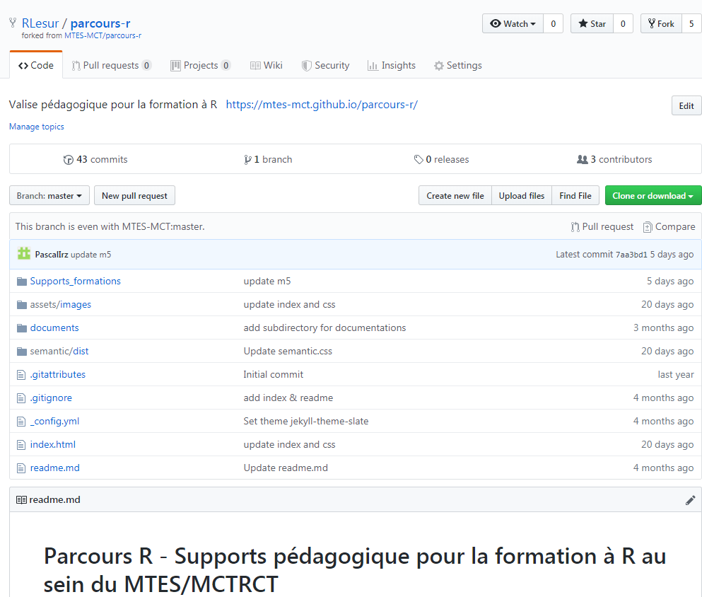
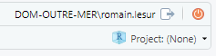
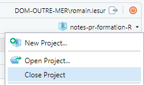
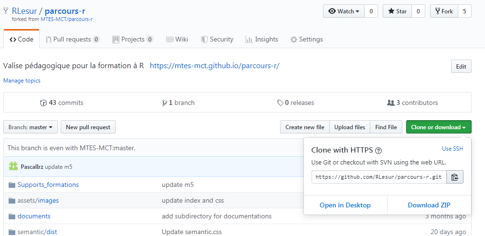

# Contribuer au parcours de formation R

Nous allons étudier un cas plus complexe, à savoir la contribution à un dépôt qui n'est pas un projet RStudio. Pour cela, nous allons devoir utiliser git dans le terminal.

Ce cas devrait vous arriver rarement car **il est vivement conseillé d'utiliser la règle 1 projet RStudio = 1 dépôt** (c'est dans cette optique que les projets RStudio ont été pensés).

Nous allons voir cela au travers d'un exemple : nous allons créer une contribution au parcours de formation R dont les fichiers source sont hébergés sur le dépôt <https://github.com/MTES-MCT/parcours-r>.

## Comment sait-on que ce dépôt n'est pas un projet RStudio ?

Pour cela, il faut acquérir un premier réflexe : lire la liste des fichiers qui se trouvent à la racine du dépôt^[la racine d'un dépôt est le premier niveau dans les dossiers.].


On constate qu'il n'y a aucun fichier qui a pour extension `.Rproj` : ce n'est pas un projet RStudio.

Une seconde habitude a acquérir est de lire le fichier `README` : il y a parfois des indications. Enfin, certains projets disposent d'un fichier `CONTRIBUTING.md` qui indique les règles pour contribuer au projet.

## Opérations sur Github

### Avoir un compte Github

Le dépôt auquel nous voulons contribuer est hébergé sur une forge logicielle qui s'appelle Github. Pour pouvoir contribuer, il est obligatoire de disposer d'un compte sur cette forge (toutes les forges fonctionnent de la même façon : on est obligé de s'identifier pour contribuer).

_détailler comment on crée un compte sur github_

Assurez-vous que vous êtes bien identifiés sur Github avant de continuer.

### Créer une copie de travail sur Github

Nous sommes dans un cas de figure très courant : nous voulons contribuer à un dépôt pour lequel nous n'avons pas les droits en écriture. Cependant, nous allons voir que nous pouvons proposer des modifications aux responsables du projet. 

Le seul moyen que nous avons pour travailler est de modifier une copie personnelle de travail de ce dépôt.

Pour cela, nous allons créer un "Fork", c'est-à-dire une copie personnelle de travail. 

Il n'y a qu'une chose à faire : sur la page d'accueil du dépôt, cliquez sur le bouton "Fork" qui se trouve en haut à droite de la page d'accueil du dépôt.

Ensuite, vous allez voir cet écran :


Et après quelques secondes, vous vous retrouvez sur une page qui ressemble à s'y méprendre à la page d'accueil du dépôt.



Arrêtez-vous quelques instants et :

- examinez le chemin qui se trouve dans la barre d'adresse de votre navigateur
- regardez attentivement ce qui est écrit en haut à gauche

Vous constatez en haut à gauche qu'il est écrit `RLesur/parcours-r` : ce n'est pas le dépôt original, c'est ma copie de travail. Et juste en dessous, il est écrit : _forked from MTES-MCT/parcours-r_. Cela signifie que cette copie de travail conserve un lien avec le dépôt "officiel".

## Opérations dans RStudio

### Préparation 

La première étape est de préparer son environnement de travail.  
Comme le projet auquel nous voulons contribuer n'est pas un projet RStudio nous ne pouvons pas utiliser la méthode classique (qui aura été vue précédemment). 
Il y a une chose importante à faire : **s'assurer que nous n'avons pas de projet RStudio d'ouvert**.  
**Comment est-ce qu'on sait si on a un projet RStudio d'ouvert ?**

Il faut regarder en haut à droite de RStudio .

Si vous voyez `Project: (None)`, cela signifie que vous n'avez aucun projet d'ouvert.

Si vous voyez autre chose, vous avez deviné, c'est que vous avez un projet d'ouvert. Et vous devez le fermer.  
Pour cela, il faut cliquer sur le nom du projet puis `Close Project` 



Maintenant que votre projet est fermé, passez à l'étape suivante.

### Créer une copie locale de sa copie de travail Github

Maintenant que vous avez fermé votre projet RStudio, nous allons encore créer une copie de travail !

Là, vous vous dites sûrement : mais on vient de le faire sur Github ? Oui, mais on comme on veut travailler depuis notre ordinateur, on va devoir réaliser une copie locale de notre copie de travail qui se trouve sur Github. Comme ça, on est tranquille, on peut travailler depuis notre ordinateur (dans le train, par exemple) et pousser plus tard nos modifications sur notre copie de travail qui se trouve sur Github.

Comme le dépôt n'est pas un projet RStudio, nous ne pouvons pas utiliser la méthode classique (qui aura été vue précédemment). Nous allons donc devoir utiliser le Terminal et y saisir des instructions.

::::card
<h4 class="card-title"> Ai-je vraiment le droit d'utiliser le terminal ? </h4>
:::card-body
Evidemment ! Le terminal, c'est un peu comme la console de R : on saisit des instructions et notre machine les exécute. Mais ce ne sont pas des instructions en langage R, c'est la seule différence. Comme avec R, on peut faire des bêtises : supprimer des fichiers, par exemple. Donc, comme toujours, il faut comprendre ce que l'on fait pour éviter de faire des erreurs.
:::
::::

Pour créer une copie locale, il va nous falloir récupérer une information : l'adresse de notre copie de travail. Elle se trouve sur la page d'accueil de notre copie de travail qui est sur Github 



Une fois l'adresse en poche, nous tapons dans le Terminal de RStudio : 

```bash
cd ~

git clone https://github.com/MONNOM/parcours-r.git
```

Et là, vous devriez voir dans le terminal :

```
Clonage dans 'parcours-r'...
remote: Enumerating objects: 848, done.
remote: Counting objects: 100% (848/848), done.
remote: Compressing objects: 100% (562/562), done.
remote: ...
```

Etant donné qu'il y a beaucoup de contenu, ça prend du temps à télécharger...

Une fois le téléchargement terminé, vous pouvez constater que vous avez un nouveau dossier intitulé `parcours-r`.

### Dernière opération importante

La dernière opération que nous allons faire est assez particulière et unique à `git`. Nous allons créer un nouveau _remote_ pour suivre le dépôt initial. Cette opération est essentielle lorsqu'on travaille avec un fork.

Tout d'abord, inspectons les _remotes_ en tapant les commandes suivantes dans le Terminal de RStudio.

Lister les remotes :

```bash
cd ~/parcours-r

git remote -v
```

Cela devrait vous renvoyer :

```
origin  https://github.com/MONNOM/parcours-r.git (fetch)
origin  https://github.com/MONNOM/parcours-r.git (push)
```

Cela signifie que pour l'instant, il n'y a qu'un seul _remote_ à votre projet et qui s'appelle `origin`. En plus, vous pouvez constater que c'est de cette façon que git va savoir avec quel serveur faire des push et des pull.

Maintenant, nous allons créer un nouveau lien avec le dépôt "officiel". Rendez-vous sur la page <https://github.com/MTES-MCT/parcours-r> et cliquez sur `Clone or download`. Copiez l'url du dépôt officiel et tapez dans le Terminal de RStudio

```bash
git remote add upstream https://github.com/MTES-MCT/parcours-r.git
```

Avec cette commande, vous définissez un nouveau remote que vous décidez d'appeler `upstream` et qui pointe sur le dépôt officiel. Vous auriez pu choisir un autre nom que `upstream` mais il s'agit d'une convention suivie par la quasi-totalité des utilisateurs de `git`. Ne cherchez pas à innover, appelez `upstream` le remote qui pointe sur le dépôt officiel.

Maintenant, vérifiez que vous avez bien deux remotes :

```bash
git remote -v
```

### Examiner le contenu de la copie locale

Le contenu de votre copie locale est identique à votre copie de travail hébergée sur Github. Vous pouvez vous déplacer dans le répertoire `parcours-r` et regarder les dossiers et les fichiers.

Si on regarde le contenu du répertoire `Supports_formations`, on constate qu'il comprend les différents modules. Si on ouvre le répertoire d'un de ces modules, on constate qu'il y a un fichier `.Rproj`. Cela signifie qu'au sein du dépôt se situent de multiples projets RStudio différents.

**Il s'agit d'une technique avancée qui n'est pas recommandée car elle nécessite une très grande expérience de tous les contributeurs au projet**. En effet, cela peut engendrer plein de problèmes.  
Pour vos projets, tenez-vous à la règle **1 projet RStudio = 1 dépôt**. C'est beaucoup plus simple et c'est ce que tous les pros font au quotidien. Vous pouvez leur faire confiance. Là encore, ne cherchez pas à innover, vous vous attirerez surtout des ennuis et n'en tirerez aucun bénéfice.

Pour autant, cela ne devrait pas vous empêcher de pouvoir contribuer.

Pour cela, vous allez ouvrir le dossier `Supports_formation/mx_travail_collaboratif`. Ensuite, cliquez sur le fichier `mx_travail_collaboratif.Rproj`.

Le projet `mx_travail_collaboratif` va alors s'ouvrir dans RStudio.

## Mode de travail standard

Maintenant que tout est configuré, vous allez pouvoir travailler, c'est-à-dire préparer une contribution. C'est de cette façon que vous pourrez contribuer à tous vos packages préférés qui sont sur Github.

Pour que tout se passe bien, vous devez respecter les règles d'or suivantes :

- toujours vérifier sur quelle branche vous vous trouvez avant de modifier un fichier
- tenir la branche master à jour du dépôt officiel
- ne jamais modifier de fichier lorsque vous êtes est sur la branche master

Il y a d'autres façons de procéder mais celle-ci est simple et fonctionne. Commencez par maîtriser cette méthode avant d'en changer. Si vous êtes vigilants et que vous respectez ces règles d'or, tout sera facile.

Le problème que vous rencontrerez fréquemment c'est que vous oublierez de vérifier sur quelle branche vous êtes avant de travailler. Nous verrons plus tard comment gérer ces étourderies qui nous arrivent à tous.

Allons-y.  
Vérifiez dans RStudio que le projet ouvert est bien `mx_travail_collaboratif`.

### Tenir master à jour du dépôt officiel

Vérifiez que vous êtes bien sur la branche master.

Téléchargez les dernières avancées du dépôt officiel : en effet, avant de créer une nouvelle contribution, il vaut mieux savoir où en est le dépôt officiel sinon vous allez travailler à partir de fichiers obsolètes !

Dans le Terminal de RStudio, exécutez

```bash
git pull upstream master
```

Ca y est, vous avez récupéré les dernières avancées.

Bon, maintenant vous voulez faire des modifications et vous vous rappelez la 3e règle d'or : ne jamais modifier de fichiers lorsque vous êtes sur master ! 

Comment faire ? Créer une nouvelle branche.

### Créer une nouvelle branche

Dans RStudio, sélectionnez l'onglet Git puis cliquez sur le bouton `New Branch`.


A la place de `Branch Name`, choisissez un nom : les espaces sont interdits ! Par exemple, `contrib/travail-collaboratif`.

Laissez la valeur de Remote à `origin` et laissez la case cochée.

Maintenant, vous êtes sur une nouvelle branche : elle apparaît en haut à droite de l'onglet Git. Ayez toujours un oeil dessus !

Vous pouvez travailler : modifiez des fichiers, faîtes des commits et poussez !

### Créer une pull request

Lorsque vous avez fini de préparer vos modifications, vous allez les proposer aux auteurs du dépôt officiel. Pour cela, rendez-vous dans Github. Allez sur la page de votre copie de travail. Sélectionnez votre branche et cliquez sur le bouton `Compare & pull request`.

Une nouvelle page s'ouvre. Rédigez votre message et cliquez sur `Create Pull Request`.

Ca y est !

Vous serez prévenus par mail lorsque les responsables du dépôt officiel échangeront avec vous ou bien intégreront vos modifications dans le dépôt officiel.

Tout cela peut paraître un peu compliqué la première fois. Mais vous verrez que dès votre première pull request, vous aurez appris. Et si vous pratiquez régulièrement, cette méthode de travail deviendra naturelle.

Vous pouvez avoir l'impression que ces compétences sont très éloignées du métier de statisticien. Détrompez-vous ! Ces compétences sont déjà des pré-requis dans de nombreux lieux, sont devenues essentielles pour collaborer avec des partenaires extérieurs et en plus, elles vous permettront de travailler avec le reste du monde et de proposer des modifications à vos packages préférés !
